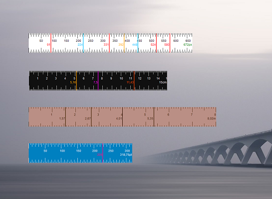

# Screen Ruler

> Configurable screen ruler for measuring in pixels, centimeters, inches, points and percent.

Screen Ruler is a lightweight and configurable ruler tool for Windows Desktop. It allows you to measure the size of elements on the screen in different units, including pixels, centimeters and inches. The ruler can be moved and resized precisely using either the mouse or the keyboard and custom marking lines can be added. Besides coming with a light and a dark theme, Screen Ruler also allows you to fully customize its appearance by changing all color settings.

## Features

- Measure in pixels, centimeters, inches, points and percent

- Dark theme and option for custom coloring

- Horizontal or vertical orientation

- Automatically measure the size of windows on screen

- Add arbitrary number of custom marking lines

- Auto-mark center or thirds of ruler

- Precise moving and resizing with keyboard shortcuts

- Fully portable with no installation needed

## Setup and Usage

#### Requirements

Screen Ruler requires Windows 7 or newer and .NET Framework 4.5 or higher.

#### How To Use

From the help window (press `F1` in the app):

> Keyboard Actions:  
Z -  Select a window to measure. Cancel with 'Esc'.  
Arrow keys -  Move the ruler by one pixel.  
Shift + Arrow keys -  Move the ruler by one medium step (defaults to 5px).  
Ctrl + Arrow keys -  Resize the ruler by one pixel.  
Ctrl + Shift + Arrow keys -  Resize the ruler by one medium step (defaults to 5px).  
Alt + Arrow keys -  Dock the ruler to screen boundaries.  
Ctrl + C -  Copy current length to clipboard.  
L -  Set marker at current length.  
C -  Remove the first custom marking line.  
Esc -  Exit Screen Ruler, window selection or help.  
See more keyboard actions in context menu.  
>
> Mouse Actions:  
Click on a position where a marker is set -  Open dialog to view/ delete marker.  
Double-click on ruler -  Set marker at the clicked position.  
Mouse wheel -  Resize the ruler.  
Shift + Mouse wheel -  Fast resizing of the ruler (large steps).  

## Version History

Read [the changelog](https://github.com/bluegrams/screenruler/blob/master/Changelog.md) to see changes in each version.

## Feedback and Support

_Please leave a feedback on [Sourceforge](https://sourceforge.net/p/screenruler/reviews) or on [AlternativeTo](https://alternativeto.net/software/bluegrams-screen-ruler/). Thank you!_

Places to get help:

* Ask on [Sourceforge](https://sourceforge.net/p/screenruler/discussion/) (General help, ideas etc.)
* Open an issue on [GitHub](https://github.com/bluegrams/screenruler/issues) (Bugs, feature requests etc.)

## Contribute

You are very welcome to contribute fixes and new features by opening a [pull request on GitHub](https://github.com/bluegrams/screenruler/pulls).

## License

This software is published under [BSD-3-Clause license](https://github.com/Bluegrams/ScreenRuler/blob/master/LICENSE.txt) by Bluegrams.
